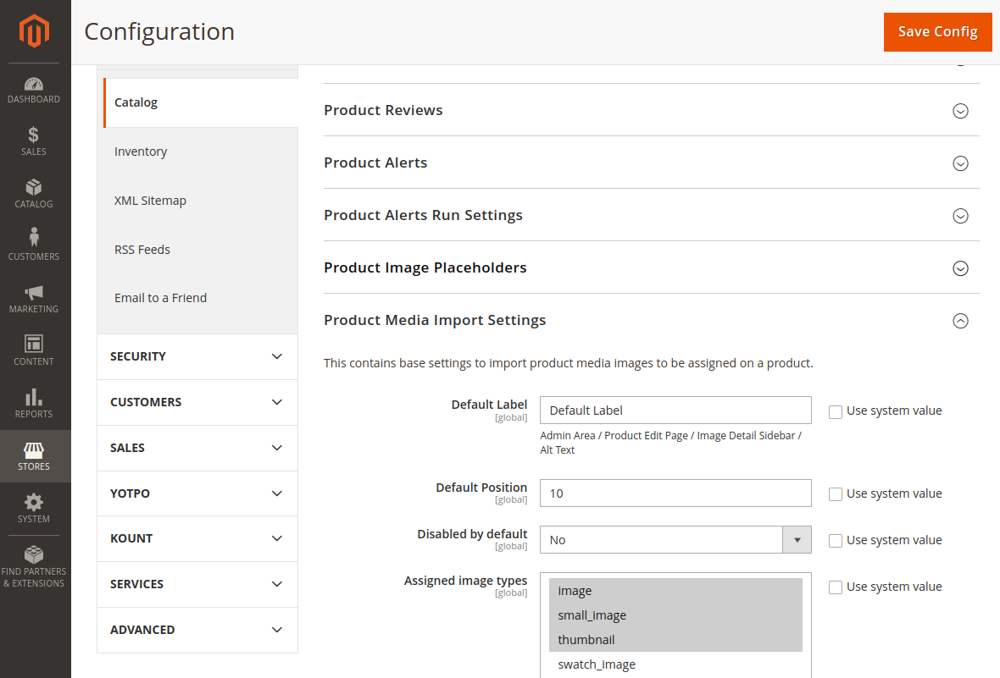

# Introduction.
This module for Magento 2 helps to download an image from external URL for further save it as a product media gallery entry.

The image will be saved on disk with the same name (name can be configured).

# Configuration.
Here you can define module basic settings.


# Usage.

## Quickstart.
Inject `\PerfectCode\ProductMediaUploader\Api\MediaEntryGeneratorInterface` to your constructor and push URL to the image you want to add to your product.
```php
$mediaEntry = $this->mediaEntryGenerator->generate(
    'http://localhost/my-image.jpg',
);
/** @var \Magento\Catalog\Api\Data\ProductInterface $product */
$product->setMediaGalleryEntries([$mediaEntry]);
// ...
$this->productRepository->save($product);
```
This will save `my-image.jpg` to `pub/media` folder and assign this image on the product, based on settings configured above.

## Save an image with a different title.

```php
$mediaEntry = $this->mediaEntryGenerator->generate(
    'http://localhost/my-image.jpg',
    ['some_attribute' => $yourCustomTitle]
);
```
Then create a plugin on `\PerfectCode\ProductMediaUploader\Api\MediaEntryGeneratorInterface::getImageName` method and reuse pushed parameter 'some_attribute'.
